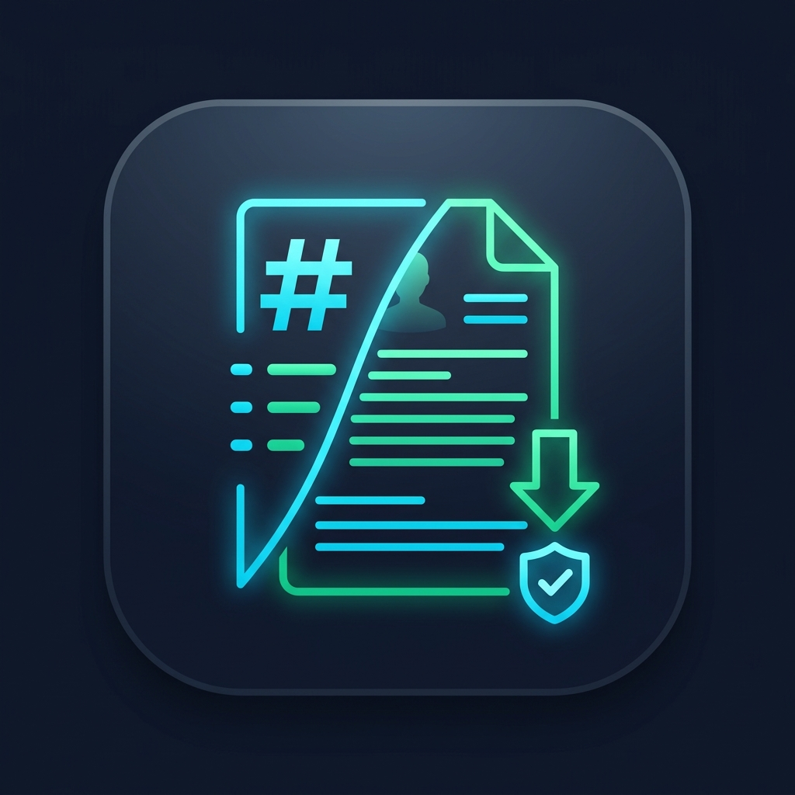
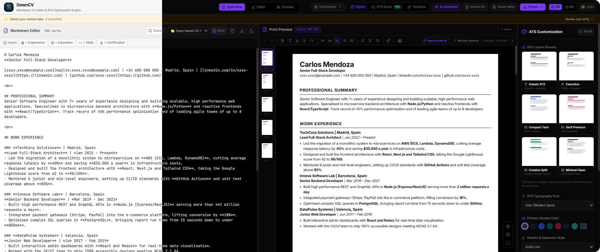
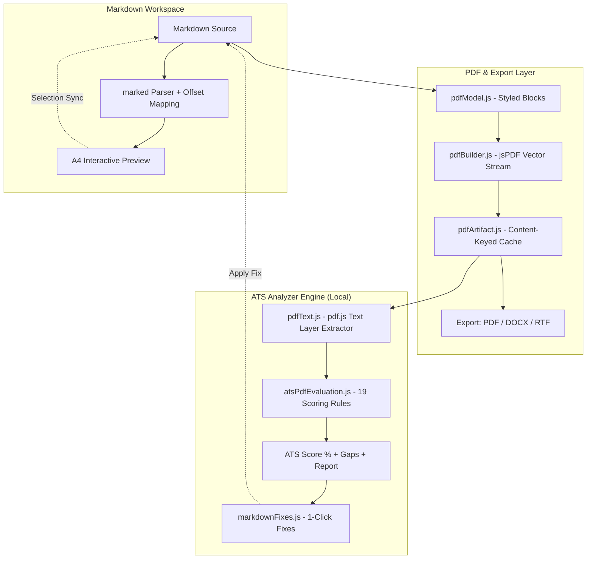

<p align="center">
  
</p>

<h1 align="center">DownCV</h1>

<p align="center">
  <strong>The Local-First, Privacy-Focused Markdown CV Builder & ATS Optimizer</strong>
</p>

<p align="center">
  <a href="#license"></a>
  <a href="https://reactjs.org/"></a>
  <a href="https://vitejs.dev/"></a>
  <a href="https://tailwindcss.com/"></a>
  <a href="https://eslint.org/"></a>
  <a href="https://vitest.dev/"></a>
  <a href="#privacy"></a>
</p>




## 📌 Overview

**DownCV** is a high-performance, open-source web application designed to help job seekers create, format, and optimize professional resumes using **Markdown**. 

Unlike web resume builders that process sensitive personal data on third-party servers, **DownCV runs 100% client-side in your browser**. It includes an isolated **Applicant Tracking System (ATS) evaluation engine** that generates real vector PDFs, reads back the text layer using `pdf.js` (exactly as real ATS parsers do), scores the resume across 12 critical dimensions, and provides **one-click automatic Markdown fixes**.


## ✨ Key Features

### ⚡ Bi-directional Markdown Editor & Live Preview

Edit raw Markdown or select text on the A4 page preview to format elements directly without breaking document syntax.

<p align="center">
  
</p>


### 🛡️ Integrated ATS Simulator & Scorer

Scores your generated PDF against realistic ATS rules (text layer integrity, keyword density, action verbs, contact information, bullet quality, etc.). Also analyses a PDF you already have, and exports the report. The score is the sum of the rules that pass, out of 100. Both lexicons are measured together, so a bilingual CV is never punished for the language of its headings or of its interface.

| Rule | Points | What it fails on |
|---|---:|---|
| `text` | 10 | The PDF has almost no selectable text (a scan or an image) |
| `pages` | 8 | More than two pages |
| `length` | 3 | Fewer than 200 or more than 900 words |
| `contact` | 9 | Fewer than two of email, phone and profile link |
| `sections` | 9 | Fewer than three standard sections found **as headings** |
| `headings` | 4 | A source heading that never reaches the sheet as a heading (a title too long, wrapped into loose lines) |
| `residue` | 6 | Markdown or HTML syntax visible in the text layer |
| `emoji` | 3 | An emoji or an image/table placeholder a parser cannot read |
| `verbs` | 10 | Fewer than four action verbs |
| `metrics` | 8 | Fewer than two numbers behind the achievements |
| `phrasing` | 5 | Fillers such as "responsible for" or "hard-working", with the verb that says it better |
| `duplicates` | 3 | The same bullet copied into two jobs |
| `keywords` | 5 | Fewer than four relevant terms, including the ones the detected role expects |
| `bullets` | 4 | More than 30% of the experience bullets with no verb and no number |
| `language` | 2 | Headings in one language and bullets in another |
| `dates` | 4 | A date in the future, two date styles mixed, or two jobs claiming the same months |
| `filename` | 2 | A file name without your name, with spaces, or marked "final" / "v2" |
| `density` | 3 | A single page over 750 words (the densest page, not the average) |
| `stuffing` | 2 | A term repeated four times in one line, or eating 6% of the document |

The panel also groups them into five dimensions (structure, contact, verbs, metrics, keywords), lists what is missing sorted by points lost, and can download the whole report as HTML.

<p align="center">
  
</p>

### ✅ Contact Review & Verification

Scans your Markdown for every email, phone and link and makes you approve each one explicitly — flagging missing domain extensions, numbers without a country code, links written without `https://`, and URLs hidden behind link text that the ATS parser never reads. Export stays blocked until every item is verified or dismissed.

<p align="center">
  
</p>

### 🗂️ CV Versions per Job Offer

Keep one tailored CV per position instead of overwriting a single document. Name each version after the offer (`Acme · Frontend Engineer`), then open, rename, duplicate or delete them independently — each one shows the keywords it adds or removes versus the CV on screen, and can be linked to a real `.md` file on disk.

<p align="center">
  
</p>

### 🤖 ATS Rewriting with Local Ollama

Select any paragraph or bullet in the preview and let your own `Ollama` model rewrite it for ATS parsing — same meaning, stronger action verbs, quantified impact. Point the endpoint to `http://localhost:11434/v1/chat/completions`, pick a model and test the connection: no data ever leaves your machine.

<p align="center">
  
</p>

### 📄 Cover Letter Generator

Automatically drafts a tailored, professional cover letter derived from your resume's key achievements and contact information.

<p align="center">
  
</p>

### 📤 Multi-Format Export

Export to native vector PDF (via jsPDF), Microsoft Word (`.docx` via OOXML), or Rich Text Format (`.rtf`).

<p align="center">
  
</p>

### 📥 Universal Resume Importer

Import existing resumes from `.pdf`, `.docx`, `.txt`, `.md`, or raw text into clean, structured Markdown.

<p align="center">
  
</p>

---

## 🛠️ Tech Stack

| Layer | Technology | Purpose |
|---|---|---|
| **Frontend Framework** | React 18 & Vite 6 | Fast SPA rendering & modern build pipeline |
| **Styling & UI** | Tailwind CSS 4 + Lucide Icons | Responsive layout, dark mode, CSS custom properties |
| **Markdown Processing** | Marked.js (Custom Renderer) | AST block tagging & bi-directional source mapping |
| **PDF Generation** | jsPDF | Native vector text streams (WinAnsi fallback, standard A4 layout) |
| **ATS Text Extraction** | PDF.js (`pdfjs-dist`) | Worker-based text layer parsing mimicking Workday/Taleo |
| **Word / RTF Export** | `docx` (OOXML) | Native `.docx` block generation and `.rtf` document creation |
| **Testing Suite** | Vitest 5 + React Testing Library | Unit & integration tests for parser, builders, and UI |
| **Deployment / Container** | Docker + Nginx Alpine | Lightweight containerized production distribution |

---

## 📐 Architecture & ATS Pipeline



### How the ATS Evaluation Works

1. **Vector Document Build**: `pdfModel.js` converts Markdown into structured style blocks. `pdfBuilder.js` renders real vector text via `jsPDF`.
2. **Content-Keyed Caching**: `pdfArtifact.js` caches generated binary blobs based on a hash of the Markdown text and layout settings, ensuring scores and downloads never drift.
3. **Text Layer Extraction**: `pdfText.js` invokes `pdf.js` to extract plain text per page, replicating how Enterprise ATS software (Workday, Taleo, Greenhouse) ingests resumes.
4. **Scoring & Diagnostics**: `atsPdfEvaluation.js` checks 19 rules worth 100 points (see the table above): text layer existence, length, contact info, section structure, headings the parser cannot read, Markdown residue, exotic characters, action verbs, numbers, weak phrasing, duplicated bullets, keywords, bullet formatting, document language, dates and chronology, file name, page density and keyword stuffing. It can also score any PDF you already have (`evaluatePdfFile`).
5. **Undoable Pure Fixes**: Detected formatting bugs (e.g. bold hashes, missing email prefix, invalid section headers) trigger single-click fixes applied via pure Markdown string transformations.

### How the Local AI Rewriter Works

The AI assistant is **entirely optional and entirely local**. DownCV never proxies your CV to anyone: it only issues one `POST` request to the endpoint *you* configure, and it talks to Ollama's OpenAI-compatible API, so any local runtime exposing `/v1/chat/completions` works.

1. **Enable it**: open the **AI Assistant** dialog (sparkles icon or `Ctrl+K` → *Open AI assistant*) and turn on *Enable AI in the preview*.
2. **Configure it**: set the endpoint (default `http://localhost:11434/v1/chat/completions`), the model name and, if your runtime requires it, an API key. Press **Test connection** to confirm the model answers.
3. **Select and rewrite**: highlight any paragraph, bullet or heading in the A4 preview and press **Improve with AI**. DownCV first offers instant offline suggestions from `enhanceBulletPoint()` (weak-verb replacement, metric detection), then **Generate with Ollama** asks your model to rewrite the fragment keeping the exact same meaning but with stronger action verbs and quantified impact.
4. **Apply it**: the answer arrives as one more suggestion; clicking it replaces only the selected range in the Markdown, so it stays undoable with `Ctrl+Z`.

The system prompt (`aiEnhancer.js`) is set to *"You are an expert ATS resume writer and career coach"*, and the request is stripped of quotes so the result can be pasted straight back into the document.

---

## 🚀 Quick Start

### Prerequisites

- **Node.js** >= 22.0.0
- **npm** >= 9.0.0

### Local Development

1. **Clone the repository**:
   ```bash
   git clone https://github.com/AcoranGonzalezMoray/DownCV.git
   cd DownCV
   ```

2. **Install dependencies**:
   ```bash
   npm install
   ```

3. **Start the development server**:
   ```bash
   npm run dev
   ```
   Open your browser at `http://localhost:3000`.

4. **Run tests**:
   ```bash
   npm run test:run
   ```

5. **Lint and format code**:
   ```bash
   npm run lint
   npm run format
   ```

### Optional: Enable the Local AI Rewriter

The ATS rewriter needs a local model runtime. With [Ollama](https://ollama.com):

```bash
ollama serve            # start the server (default port 11434)
ollama pull llama3      # or any other chat model you prefer
```

Then in DownCV open the **AI Assistant** dialog, enable it, and press **Test connection**. Any runtime that speaks the OpenAI `/v1/chat/completions` schema (Ollama, LM Studio, llama.cpp server, vLLM…) works by changing the endpoint.

---

## 🐳 Docker Setup

DownCV can be easily containerized and served using Nginx.

### Using Docker Compose

```bash
docker compose up -d --build
```
Access DownCV in your browser at `http://localhost:8080`.

### Manual Docker Build

```bash
docker build -t down-cv .
docker run -d -p 8080:80 down-cv
```

---

## 📂 Project Structure

```
DownCV/
├── public/                 # Static assets, app icons & PWA manifest
├── src/
│   ├── components/         # React components
│   │   ├── ATSAnalyzer.jsx       # ATS score display, recommendations, 1-click fixes
│   │   ├── AIAssistantModal.jsx  # Ollama endpoint / model settings & connection test
│   │   ├── AiRewritePopover.jsx  # AI rewrite suggestions popover
│   │   ├── ContactWarnings.jsx   # Unverified email/phone/link banner & validator
│   │   ├── CoverLetterModal.jsx  # Cover letter generator & PDF exporter
│   │   ├── CVPreview.jsx         # A4 paper preview with direct formatting tools
│   │   ├── ExportMenu.jsx        # Dropdown menu for PDF, DOCX, RTF, PNG, JSON, HTML
│   │   ├── ImportModal.jsx       # Import PDF, DOCX, TXT, or MD into Markdown
│   │   ├── MarkdownEditor.jsx    # Caret shortcuts, sample CVs, search, draft history
│   │   ├── StyleControls.jsx     # Font, color palette, margin, line height & layout presets
│   │   ├── ThemeToggle.jsx       # Dark / light mode toggle
│   │   └── VariantsPanel.jsx     # Named CV versions per job offer & local .md file
│   ├── data/               # Static seed data & i18n strings
│   │   ├── sampleCVs.js         # Ready-to-edit sample CVs per language
│   │   ├── snippets.js          # Reusable section snippets
│   │   ├── templates.js         # Layout template presets
│   │   └── translations.js      # English & Spanish UI strings
│   ├── hooks/              # Custom React hooks
│   │   ├── useContactVerification.js # Verification logic for email/phone/URLs
│   │   ├── useKeyboardShortcuts.js   # Global hotkeys (Ctrl+S, Ctrl+Z, etc.)
│   │   ├── useLocalFile.js           # File System Access API .md linking
│   │   ├── useLocalStorage.js        # Synced localStorage state
│   │   └── useMarkdownHistory.js     # Pure undo/redo state stack
│   ├── utils/              # Pure business logic & formatting modules
│   │   ├── aiEnhancer.js        # Local bullet enhancer + Ollama OpenAI-compatible client
│   │   ├── atsDimensions.js     # Rule groups behind the radar chart
│   │   ├── atsPdfEvaluation.js   # Main ATS evaluation orchestration (19 rules / 100 pts)
│   │   ├── atsReport.js          # Standalone HTML score report
│   │   ├── atsScorer.js          # Action verbs, keywords & weak phrase lexicons
│   │   ├── contactScan.js        # Contact parser & regex scanner
│   │   ├── coverLetter.js        # Template logic for cover letter creation
│   │   ├── cvImport.js           # Converter from arbitrary text to clean MD
│   │   ├── cvVariants.js         # CV version creation & keyword diffing
│   │   ├── docxGenerator.js      # OOXML (.docx) and RTF document exporter
│   │   ├── jobMatcher.js         # Job description keyword match score
│   │   ├── jsonResume.js         # JSON Resume (jsonresume.org) import/export
│   │   ├── markdownFixes.js      # Pure 1-click Markdown issue resolution
│   │   ├── markdownParser.js     # marked AST parser with source line offsets
│   │   ├── pdfBuilder.js         # Vector PDF rendering engine using jsPDF
│   │   └── pdfText.js            # pdf.js text layer reader worker
│   ├── App.jsx             # Main application layout & state coordinator
│   └── main.jsx            # Application entry point
├── Dockerfile              # Multi-stage production build
├── docker-compose.yml      # Local Docker configuration
└── vite.config.js          # Vite build configuration
```

---

## 🗺️ Roadmap & Improvement Plan

We have an active product roadmap! Check out our planned features and technical improvements:
- 🎨 **Multi-column & Visual Template System** (Sidebar skills/contacts vs main timeline).
- 🌍 **More languages**: the UI is fully translated to English and Spanish today; French, German and Portuguese are next.
- 🧩 **Plugin-style ATS rule packs**: let users define their own scoring rules as JSON instead of hardcoding them.
- 🧪 **Snapshot tests for the generated PDF text layer**, to lock the ATS score against regressions.
- ⌨️ **Richer keyboard navigation** across the preview, the variants panel and the command palette.

---

## 🤝 Contributing

Contributions are warmly welcomed! Whether you want to fix a bug, add a new ATS scoring rule, translate to a new language, or suggest a feature:

1. Fork the project.
2. Create your feature branch (`git checkout -b feature/AmazingFeature`).
3. Commit your changes (`git commit -m 'Add some AmazingFeature'`).
4. Ensure tests and linting pass (`npm run lint && npm run test:run`).
5. Push to the branch (`git push origin feature/AmazingFeature`).
6. Open a Pull Request.

---

## 📄 License

Distributed under the **MIT License**. See [`LICENSE`](./LICENSE) for more information.

<p align="center">
  Crafted with ❤️ for privacy and career success.
</p>
